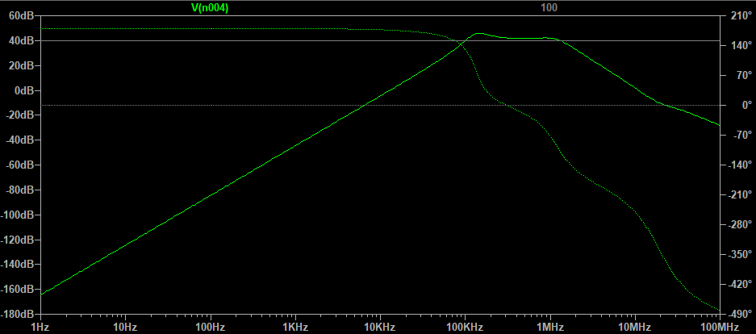
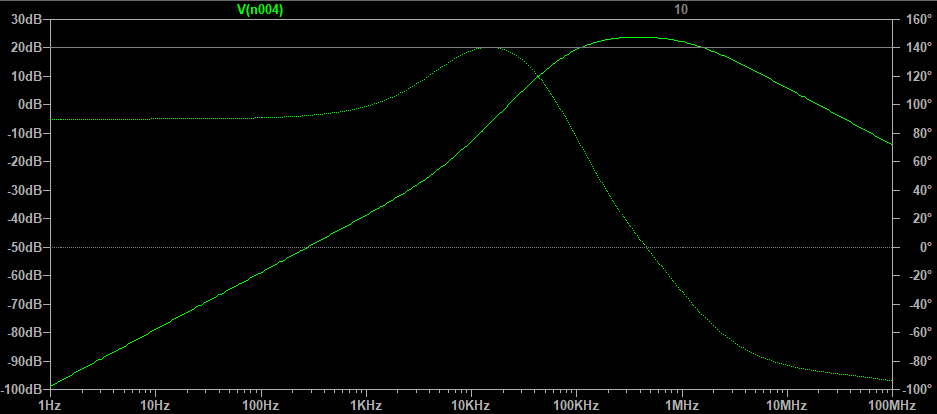

# Writeup

## Software

## Hardware

Block diagrams are as follows:

### LC Pieces

### Receiver Grid & Row Amplifier

<figure>
  
  <figcaption>Transfer Function for Row Amplifier</figcaption>
</figure>

### Demultiplexer

### ADC Amplifier and Bandpass Filter

<figure>
  
  <figcaption>Transfer Function for ADC Amplifier/Filter</figcaption>
</figure>

### Microcontroller/Rotary Encoders/Buttons

### USB Interface

### OLED Display and Display Driver Code

### Waveform Detector

### Column Driver and Driver Code

### Power Supply 

